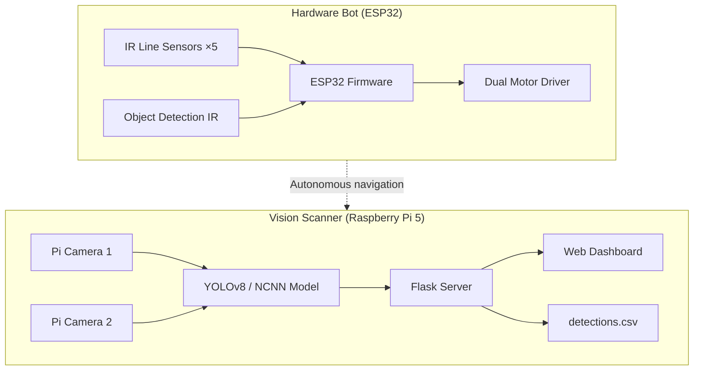

# Bot Design Challenge

An end-to-end robotics and computer-vision system built for a bot design challenge. The project combines an **ESP32-based autonomous line-following robot** with a **Raspberry Pi 5 dual-camera YOLO detection pipeline**, live web dashboard, and structured CSV logging.

The hardware bot navigates a track using IR sensors and performs obstacle avoidance, while the software stack runs real-time multi-object detection across two Pi Camera modules and presents results in a browser dashboard using a standardized **Category / Content** output format.

---

## Overview

| Subsystem | Platform | Purpose |
|-----------|----------|---------|
| **Hardware Bot** | ESP32 + motor driver + IR sensors | Line following, intersection turns, object avoidance |
| **Vision Scanner** | Raspberry Pi 5 + dual Pi Camera Rev 1.3 | Real-time YOLOv8 inference, QR/plate decoding, live dashboard |

Together, these components form a complete challenge solution: a mobile robot that can traverse a course autonomously, and a vision station that identifies, categorizes, and logs objects in the environment.

---

## Key Features

### Hardware (ESP32)

- **5-sensor IR line tracking** — far-left, left, center, right, far-right
- **Dual-motor differential drive** with PWM speed control
- **Line following** with gradual and strong correction modes
- **Intersection handling** — perpendicular left/right turns at T-junctions
- **Object avoidance** — dedicated IR object-detection sensor triggers a multi-step maneuver (reverse, turn, forward, re-align)
- **Serial debug output** for live sensor state monitoring

### Software (Raspberry Pi 5)

- **Dual-camera MJPEG streaming** via Flask
- **Custom YOLOv8 model** with 18 detection classes
- **NCNN model support** for faster CPU inference on the Pi
- **Live QR code decoding** using OpenCV
- **Number plate OCR** using Tesseract
- **Browser dashboard** with Category / Content output format
- **Manual stopwatch** (START / PAUSE / RESET) synced to CSV logs
- **Background CSV writer** — non-blocking detection loop
- **Auto-retry** for disconnected cameras
- **systemd service** for boot-time autostart

---

## Technologies Used

### Hardware Stack

| Technology | Role |
|------------|------|
| **ESP32** | Main microcontroller |
| **TB6612 / dual H-bridge motor driver** | Motor control (AIN1/2, BIN1/2, PWMA/B, STBY) |
| **IR reflective sensors (×5)** | Line tracking |
| **IR object-detection sensor** | Obstacle trigger |
| **Arduino / ESP-IDF (`ledc`)** | PWM motor control |
| **C++ (`.ino`)** | Firmware |

### Software Stack

| Technology | Role |
|------------|------|
| **Python 3** | Application runtime |
| **Flask 3** | Web server, MJPEG streams, REST API |
| **Ultralytics YOLOv8** | Object detection inference |
| **NCNN** | Optimized model format for Raspberry Pi CPU |
| **OpenCV** | Frame processing, QR decoding, OCR preprocessing |
| **Picamera2** | Raspberry Pi camera capture |
| **Tesseract OCR** | Vehicle number plate text extraction |
| **NumPy** | Array / image operations |
| **HTML / CSS / JavaScript** | Live dashboard UI |
| **systemd** | Production autostart service |
| **Bash** | One-time setup automation |

### Target Hardware (Vision System)

| Component | Specification |
|-----------|---------------|
| SBC | Raspberry Pi 5 |
| Cameras | 2× Pi Camera Module Rev 1.3 (OV5647, 5 MP) |
| Connections | CAM0 and CAM1 FFC ports |
| Storage | MicroSD 16 GB+ |
| OS | Raspberry Pi OS (64-bit) |

---

## System Architecture


---

## Repository Structure

```
BotDesignChallenge/
├── README.md                              # This file — project overview
└── Codebase/
    ├── Hardware/
    │   └── kriti_2026_esp_code.ino        # ESP32 line-following & avoidance firmware
    └── Software/
        ├── README.md                      # Detailed software setup guide
        ├── requirements.txt               # Python dependencies
        ├── app/
        │   ├── app.py                     # Flask server + YOLO inference engine
        │   └── templates/
        │       └── index.html             # Live dashboard UI
        ├── model/
        │   ├── best.pt                    # YOLOv8 PyTorch weights (fallback)
        │   ├── best_ncnn_model.param      # NCNN architecture (fastest on Pi)
        │   └── best_ncnn_model.bin        # NCNN weights
        ├── data/
        │   └── detections.csv             # Auto-generated detection log
        ├── config/
        │   └── yolo_scanner.service       # systemd autostart unit
        └── scripts/
            └── setup.sh                   # One-time Raspberry Pi setup
```

### Behavior

1. **Object avoidance (priority)** — When the object-detection sensor triggers, the bot reverses, turns left, moves forward, turns right, and re-aligns on the line.
2. **Intersection turns** — Far-left or far-right sensor LOW triggers a perpendicular turn until the center sensor re-acquires the line.
3. **Line following** — Center-on-line drives forward; off-center patterns trigger slight or strong corrections.
4. **All-sensors-white** — Bot stops (end of track / lost line).

---

## Getting Started

### Software (Raspberry Pi 5)

**1. Clone the repository**

```bash
git clone <repo-url>
cd BotDesignChallenge/Codebase/Software
```

**2. Copy model files** (if not included in the clone)

```bash
scp best.pt best_ncnn_model.param best_ncnn_model.bin pi@<rpi-ip>:~/BotDesignChallenge/Codebase/Software/model/
```

**3. Run the setup script (once)**

```bash
bash scripts/setup.sh
```

This installs system packages (`python3-picamera2`, `tesseract-ocr`, `libopencv-dev`), creates a Python virtual environment, and optionally installs the systemd autostart service.

**4. Start the application**

```bash
source venv/bin/activate
python app/app.py
```

**5. Open the dashboard** on any device on the same network:

```
http://<raspberry-pi-ip>:5000
```

Press `Ctrl+C` to stop — cameras and the CSV writer shut down cleanly.

### Hardware (ESP32)

1. Wire IR sensors and motor driver per the pin map above
2. Flash `Codebase/Hardware/kriti_2026_esp_code.ino` via Arduino IDE
3. Place the bot on the track and monitor serial output at 115200 baud

---